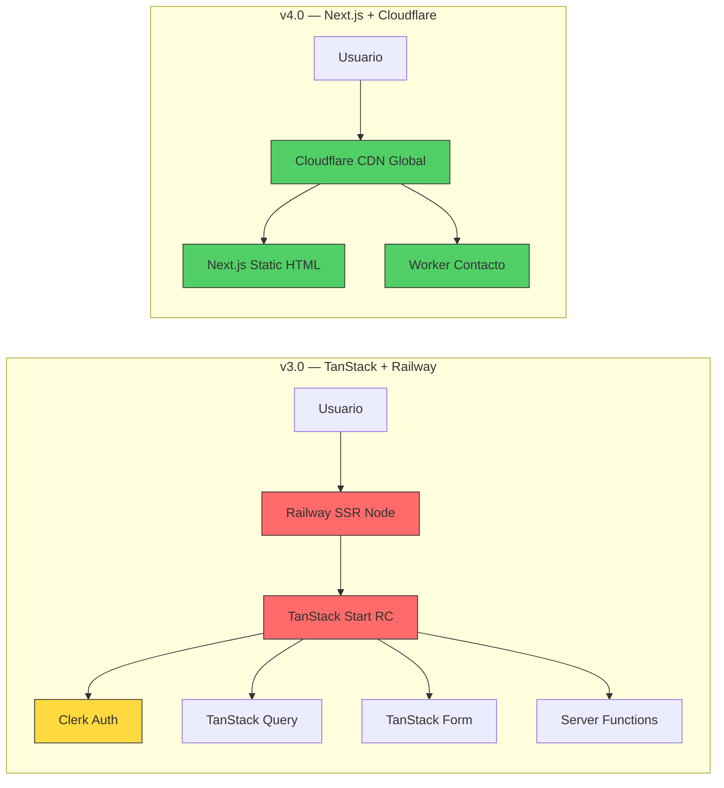

# Análisis GO / NO-GO y Plan Optimizado — Sitio Personal de Alta Autoridad

**Versión:** 4.0 — Análisis Definitivo  
**Fecha:** 17 de junio de 2026  
**Objeto auditado:** [PLAN_IMPLEMENTACION_CLAUDE_CODE.md](file:///Users/MAC/Documents/Personal%20Site/PLAN_IMPLEMENTACION_CLAUDE_CODE.md) (v3.0)  
**Referencia cruzada:** [PLAN_DESARROLLO_REVISADO.md](file:///Users/MAC/Documents/Personal%20Site/PLAN_DESARROLLO_REVISADO.md) (v2.1)  
**Misión:** Crear una página personal disruptiva, poderosa y simple, con valor añadido inequívoco — proyectar autoridad mediante claridad, evidencia y ejecución técnica.

---

## Determinación Ejecutiva

```
┌─────────────────────────────────────────────────────────────┐
│                                                             │
│   PLAN v3.0 (Claude Code):  ❌ NO-GO PARA CONSTRUCCIÓN    │
│                                                             │
│   Razón: Violaciones de la misión, sobrecosto innecesario, │
│   riesgo de stack inestable y complejidad sin beneficio     │
│   para el usuario final.                                    │
│                                                             │
│   PLAN OPTIMIZADO v4.0:     ✅ GO PARA CONSTRUCCIÓN        │
│                              ⚠️ GO CONDICIONADO PARA       │
│                                 PUBLICAR (gates G0-G4)      │
│                                                             │
└─────────────────────────────────────────────────────────────┘
```

---

## 1. Conflicto Fundamental Entre Planes

Los dos documentos son **mutuamente excluyentes**. El plan v2.1 fue aprobado como GO y el v3.0 lo reemplaza completamente sin justificación proporcional al riesgo que introduce.

| Dimensión | Plan v2.1 (Revisado) | Plan v3.0 (Claude Code) | Veredicto |
|---|---|---|---|
| Framework | Next.js estable (16.x), App Router | TanStack Start **RC** + TanStack CLI **alpha** | ❌ v3.0 introduce riesgo sin beneficio para el usuario |
| Renderizado | Static export — cero servidor | SSR Node — servidor siempre encendido | ❌ v3.0 añade costo permanente innecesario |
| Hosting | Cloudflare Static Assets — **$0/mes** | Railway SSR — **$5-7+/mes mínimo** | ❌ v3.0 viola el principio de mínimo costo |
| Autenticación | No necesaria en MVP | Clerk — $0 pero añade ~40-80KB JS al bundle público | ❌ v3.0 añade complejidad para un panel mínimo |
| Package manager | pnpm (v2.1) / npm (v3.0) | npm obligatorio | ⚪ Neutral |
| Formulario | Cloudflare Worker + Turnstile | TanStack Server Function + Resend + Turnstile | ⚪ Equivalente funcional |
| Linting | No especificado (v2.1) | Biome único | ✅ v3.0 mejora aquí |
| Code Review | No especificado | CodeRabbit como GitHub App | ✅ v3.0 añade valor sin costo |
| Testing | Vitest + Playwright + axe + Lighthouse | Igual + Testing Library | ✅ Equivalente |
| Sistema visual | Glassmorphic Grid Layering + Motion | Idéntico | ✅ Ambos comparten la visión |

---

## 2. Bloqueantes Identificados en el Plan v3.0

### 🔴 BLOQUEANTE B-01 — Stack Inestable en Producción

> [!CAUTION]
> TanStack Start sigue en **Release Candidate** y TanStack CLI está en **alpha**. Construir un sitio personal que debe proyectar "autoridad técnica" sobre un framework que no ha alcanzado v1.0 estable es una **contradicción directa con la misión**.

**Evidencia:**
- La documentación oficial de TanStack Start advierte que las APIs pueden cambiar entre RCs
- El CLI tiene comandos que pueden variar sin previo aviso
- El propio plan v3.0 reconoce esto (sección 3, líneas 99-104) pero lo acepta como "riesgo mitigado"
- No existe un ecosistema maduro de producción comparable a Next.js

**Impacto:** Si la API cambia entre RCs, hay que reescribir partes del sitio. Un portafolio profesional no debe estar sujeto a la estabilidad de un RC.

**Veredicto:** **NO-GO** — Usar framework estable (Next.js 16.x).

---

### 🔴 BLOQUEANTE B-02 — SSR Innecesario = Costo Permanente Sin Justificación

> [!CAUTION]
> El plan v3.0 requiere un servidor Node.js siempre activo en Railway para servir un sitio que es fundamentalmente **contenido editorial estático**. Esto viola directamente el principio de "menor costo" de la misión.

**Análisis de costos:**

| Arquitectura | Costo mensual | Costo anual |
|---|---:|---:|
| Cloudflare Static (v2.1/v4.0) | **$0** | **$0** |
| Railway SSR (v3.0) | $5-7 mínimo | $60-84 |
| Railway + Clerk + Resend | $7-15 estimado | $84-180 |

**¿Por qué se eligió SSR?** Únicamente para soportar:
1. Clerk middleware (autenticación servidor)
2. Server functions (formulario de contacto)
3. Loaders SSR (SEO)

**¿Se necesita realmente?**
1. **Clerk** → Un `/admin` que solo muestra estado de contenido no justifica autenticación compleja. Solución: proteger con HTTP Basic Auth en el Worker, o eliminar `/admin` del MVP.
2. **Server functions** → Un Cloudflare Worker hace exactamente lo mismo a costo $0.
3. **Loaders SSR para SEO** → Static export con `generateMetadata` logra el mismo resultado. El contenido MDX ya es estático.

**Veredicto:** **NO-GO** — SSR no aporta valor para este caso de uso. Static export es superior.

---

### 🔴 BLOQUEANTE B-03 — Clerk Inflaciona el Bundle Público Sin Necesidad

> [!WARNING]
> `@clerk/tanstack-react-start` añade entre 40-80KB de JavaScript gzippeado al bundle público, incluso si la autenticación solo se usa en `/admin`. El `ClerkProvider` envuelve toda la aplicación.

**Cálculo de impacto:**
- Budget de JS del plan v3.0: ≤150KB gzip/ruta
- Clerk consume 30-50% de ese presupuesto
- El usuario público **nunca** necesita autenticación
- El plan v3.0 reconoce esto como "GO condicionado" pero no lo resuelve

**Veredicto:** **NO-GO** en MVP — Clerk no justifica su peso para un panel de estado.

---

### 🟡 MAYOR M-01 — TanStack Query sin Caso de Uso Real

El plan v3.0 dice: "La mutación `contact.submit` es el primer uso real de Query." Pero:
- Un formulario de contacto con `fetch` + estados locales es trivial
- Query añade ~15KB gzip al bundle
- No hay datos remotos que cachear, reintentar o sincronizar
- El propio plan excluye TanStack Table, DB, CMS y cualquier dato persistente

**Tratamiento:** Retirar Query del MVP. Un `fetch` con estado local en el componente del formulario es suficiente y más simple.

---

### 🟡 MAYOR M-02 — TanStack Form + createFormHook es Sobre-Ingeniería

Para un **único formulario** (contacto), crear:
- `createFormHookContexts` 
- `createFormHook`
- 5+ componentes registrados (`TextField`, `SelectField`, `TextAreaField`, `CheckboxField`, `SubmitButton`, `FieldError`)

...es desproporcionado. Un formulario con React Hook Form (ya maduro) o incluso `<form>` nativo con validación Zod servidor es más simple y ligero.

**Tratamiento:** Usar formulario nativo + Zod + server action/Worker. Ahorra ~20KB de bundle.

---

### 🟡 MAYOR M-03 — 12 Variables de Entorno para un Sitio Personal

```text
NODE_ENV, APP_URL, ALLOWED_PREVIEW_ORIGINS, CLERK_PUBLISHABLE_KEY,
CLERK_SECRET_KEY, CLERK_SIGN_IN_URL, CLERK_SIGN_UP_URL,
TURNSTILE_SECRET, VITE_TURNSTILE_SITE_KEY, RESEND_API_KEY,
CONTACT_TO, CONTACT_FROM
```

De estas, 4 son de Clerk (innecesario), 2 de Turnstile, 2 de Resend y 4 de configuración. Eliminando Clerk se reducen a 8, que es manejable.

---

### 🟡 MAYOR M-04 — Dockerfile Multi-Stage para un Sitio Personal

El plan v3.0 requiere:
- Dockerfile multi-stage con Node LTS Alpine
- `npm ci` en CI
- Copiar `.output` a imagen runtime
- Configurar `PORT` y `0.0.0.0`
- Healthcheck endpoint

Esto es infraestructura de microservicio, no de portafolio personal. Con static export, el deploy es `wrangler deploy` o un push a GitHub → Cloudflare Pages.

---

### 🟢 ACIERTOS del Plan v3.0 que se Preservan

| Acierto | Por qué se mantiene |
|---|---|
| Biome como toolchain único | Simplifica DX, elimina conflictos ESLint/Prettier |
| CodeRabbit como GitHub App (sin SDK) | Review externo sin costo ni código runtime |
| MDX local + Zod validado | Contenido versionado y auditable |
| Glassmorphic Grid Layering (5 capas) | Sistema visual de autoridad, bien especificado |
| Motion (Framer Motion) con `LazyMotion` | Movimiento cinemático con control de rendimiento |
| `GlassCard` con props tipadas | Componente reutilizable con niveles de intensidad |
| Esquema de contenido con `ProjectStatus` | `draft` nunca llega a producción |
| Presupuestos de rendimiento explícitos | LCP, INP, CLS con targets medibles |
| WCAG 2.2 AA desde el diseño | Accesibilidad como requisito, no como checklist |
| CSP report-only → bloqueante | Seguridad progresiva |
| `theme-init.js` para evitar flash | Solución correcta al FOUC de temas |

---

## 3. Análisis GO / NO-GO Completo

### Tabla de Bloqueantes

| ID | Bloqueante | Origen | Resolución v4.0 | Flag |
|---|---|---|---|---|
| B-01 | TanStack Start RC / CLI alpha | v3.0 | Next.js 16.x estable | **NO-GO v3.0 → GO v4.0** |
| B-02 | SSR + Railway = $5-7+/mes sin necesidad | v3.0 | Static export + Cloudflare = $0 | **NO-GO v3.0 → GO v4.0** |
| B-03 | Clerk infla bundle público para /admin mínimo | v3.0 | Eliminar Clerk; /admin con Basic Auth o local | **NO-GO v3.0 → GO v4.0** |
| B-04 | Contenido sin evidencia real | Ambos | Gates editoriales G0/G2 | **GO condicionado** |
| B-05 | Objetivos absolutos de rendimiento | v2.1 | CWV al p75 + budgets | **GO (resuelto en ambos)** |

### Tabla de Hallazgos Mayores

| ID | Hallazgo | Riesgo | Tratamiento v4.0 | Estado |
|---|---|---|---|---|
| M-01 | TanStack Query sin caso de uso real | Sobrecarga de bundle | Retirar; usar `fetch` + estado local | **Eliminado** |
| M-02 | TanStack Form sobre-ingeniería para 1 form | Complejidad desproporcionada | Formulario nativo + Zod | **Simplificado** |
| M-03 | 12 variables de entorno | Complejidad operativa | 8 variables (-4 de Clerk) | **Reducido** |
| M-04 | Docker multi-stage para portafolio | Sobre-ingeniería | `wrangler deploy` o Cloudflare Pages | **Eliminado** |
| M-05 | Motion puede degradar INP/LCP | Rendimiento | `LazyMotion`, Motion Values, budgets | **Mitigado (preservado)** |
| M-06 | Glassmorphism puede perder contraste | Accesibilidad | Base opaca, fallback, WCAG AA | **Mitigado (preservado)** |
| M-07 | Doble tema amplía QA | Tiempo | Vertical slice temprano | **Aceptado** |
| M-08 | SF Pro sin licencia web | Legal | Inter Variable local por defecto | **Mitigado (preservado)** |
| M-09 | Mobile puede perder la firma reactiva | UX | Variante touch por scroll/foco | **GO condicionado** |

---

## 4. Plan Optimizado v4.0 — Arquitectura de Máxima Eficiencia

### Principios Rectores

```
1. COSTO MÍNIMO    → $0/mes en infraestructura base
2. VELOCIDAD MÁXIMA → Static = CDN global = TTFB <100ms
3. BELLEZA MÁXIMA   → Glassmorphic Grid Layering + Motion cinemático
4. AUTORIDAD        → Evidencia > adjetivos; ejecución > tecnología
5. SIMPLICIDAD      → Menos dependencias = menos superficie de ataque
```

### Stack Definitivo v4.0

| Capa | Elección | Justificación |
|---|---|---|
| **Framework** | **Next.js 16.x estable**, App Router, TypeScript estricto | Framework de producción probado; sin riesgo de breaking changes |
| **Renderizado** | **Static export** (`output: 'export'`) | TTFB <100ms desde CDN, $0 de servidor, máximo rendimiento |
| **Hosting** | **Cloudflare Pages** (estáticos) + **Worker** (contacto) | Gratis dentro de cuotas, CDN global, protección DDoS incluida |
| **Estilos** | **Tailwind CSS** + tokens CSS semánticos | Velocidad de desarrollo + control de diseño |
| **Movimiento** | **Motion for React** (Framer Motion) | `LazyMotion`, Motion Values, scroll y transiciones estables |
| **Tipografía** | **Inter Variable** local, WOFF2, subset latino | Self-hosted, preload, `font-display: swap`, métricas ajustadas |
| **Contenido** | **MDX local** + **Zod** validación build-time | Versionado, auditable, sin CMS ni costo |
| **Formulario** | **Cloudflare Worker** + Turnstile + Resend REST | Validación servidor, antispam, entrega por email, $0 |
| **Analítica** | **Cloudflare Web Analytics** | Agregada, sin cookies, gratuita, orientada a privacidad |
| **Imágenes** | **Pipeline build** → AVIF/WebP + `<picture>` | Sin optimización dinámica; control total |
| **Linting** | **Biome** único | Formatter + linter + import sorting |
| **Code Review** | **CodeRabbit** GitHub App + YAML | Review externo sin código runtime |
| **CI/CD** | **GitHub Actions** | Checks bloqueantes, preview y deploy automatizado |
| **Testing** | **Vitest** + Testing Library + **Playwright** + axe + Lighthouse CI | Cobertura por riesgo |
| **Package Manager** | **npm** con lockfile | Reproducibilidad con `npm ci` |

### Decisiones Negativas Explícitas (NO-GO)

| Tecnología | Razón de exclusión |
|---|---|
| TanStack Start / Router / CLI | RC/alpha; riesgo innecesario para sitio de producción |
| TanStack Query | Sin datos remotos que cachear/reintentar |
| TanStack Form | Sobre-ingeniería para un formulario |
| TanStack Table | No existen data grids |
| Clerk | Bundle excesivo para panel mínimo; innecesario en MVP |
| Railway | Servidor Node permanente sin justificación |
| Supabase | Sin datos persistentes |
| ISR / SSR | Contenido estático; actualización por build |
| ESLint / Prettier | Biome los reemplaza |
| pnpm | npm es suficiente y más universal |
| IA Playground | NO-GO hasta cumplir puerta IA completa |
| WebGL / 3D pesado | Innecesario; el glass layering logra profundidad sin GPU |

### Economía Comparada

| Escenario | v3.0 (TanStack + Railway) | v4.0 (Next.js + Cloudflare) | Ahorro |
|---|---:|---:|---:|
| Mes base | $5-7 | **$0** | 100% |
| Año 1 | $60-84 | **$0** | $60-84 |
| Con dominio | $72-96 | **$12** (solo dominio) | $60-84 |
| Crecimiento moderado | $15-25/mes | **$0-5/mes** | 70-100% |

---

## 5. Estructura Funcional v4.0

```text
/
├── /proyectos
│   └── /proyectos/[slug]
├── /investigacion
├── /sobre-mi
├── /contacto
├── /privacidad
└── /404
```

> [!NOTE]
> Se elimina `/admin`, `/sign-in` y `/sign-up` del MVP. El estado de contenido se valida en build-time con Zod; no se necesita un panel web para ver qué drafts existen — eso lo muestra el CI y el propio repositorio.

### Sitio Público (todo el sitio es público)
- Navegación global, hero cinético, proyectos destacados (Bento), capacidades, investigación, principios, CTA y footer
- 3-5 casos reales antes del lanzamiento; drafts nunca se exportan
- Filtros de `/proyectos` en URL search params, no estado global
- Investigación con publicaciones verificadas y líneas de interés
- Contacto accesible con fallback de correo visible
- Temas claro/oscuro/sistema

---

## 6. Sistema Visual — Se Preserva Íntegro

> [!IMPORTANT]
> El sistema visual es el activo más valioso de ambos planes y **no cambia** con la optimización de arquitectura. Glassmorphic Grid Layering, Motion cinemático, Bento editorial y la tipografía ultraoptimizada funcionan perfectamente con static export.

### Glassmorphic Grid Layering (5 capas)

| Plano | Función | Implementación |
|---|---|---|
| 0 — Atmosphere | Identidad y profundidad global | Gradientes radiales, ruido sutil, color ambiental |
| 1 — Structural Grid | Ritmo Bento editorial | CSS Grid asimétrico, guías de baja opacidad |
| 2 — Glass Surfaces | Contenedor de contenido | Fondo translúcido, `backdrop-filter`, fallback opaco |
| 3 — Reactive Light | Respuesta a puntero/foco | Spotlight vía CSS variables, limitado al contenedor activo |
| 4 — Content | Autoridad y legibilidad | Tipografía de alto contraste, datos y CTA sin transparencia |

### GlassCard Props

```ts
interface GlassCardProps {
  level?: "quiet" | "default" | "featured";
  interactive?: boolean;
  spotlight?: boolean;
  tilt?: boolean;
  children: React.ReactNode;
  className?: string;
}
```

### Motion — Momentos Distintivos

1. **Hero vivo:** luz ambiental con inercia, titular por segmentos semánticos
2. **Bento reveal:** tarjetas emergen por grupos con `useInView({ once: true })`
3. **Border spotlight:** luz localizada sigue puntero vía Motion Values + CSS vars
4. **Tilt de precisión:** ±2.5° máximo, solo `pointer: fine`, spring de retorno
5. **Feedback de contacto:** microanimación de estados, sin confeti
6. **Scroll depth:** `useScroll` + `useTransform` + `useSpring`, rango ≤32px

### Reglas Inquebrantables

- `prefers-reduced-motion: reduce` → elimina parallax, tilt, stagger espacial
- `pointer: coarse` → elimina spotlight seguido y 3D tilt
- Foco visible con contraste suficiente
- Ningún contenido depende de hover, blur o animación
- Máximo 3 superficies reactivas simultáneas
- Motion Values y CSS vars; **nunca** `setState` por frame

---

## 7. Contenido y Esquema MDX

```ts
type ProjectStatus = "published" | "private-summary" | "archived" | "draft";

interface ProjectFrontmatter {
  title: string;
  slug: string;
  summary: string;
  year: number;
  status: ProjectStatus;
  role: string;
  problem: string;
  outcomes: string[];
  technologies: string[];
  evidenceLinks: Array<{ label: string; url: string }>;
  featured: boolean;
  order: number;
  updatedAt: string;
  cover: { src: string; alt: string };
}
```

### Reglas Editoriales
- Validar frontmatter con Zod en build
- Build falla ante slugs duplicados, fechas inválidas, campos vacíos
- Drafts **nunca** se exportan a producción
- Un `outcome` es una afirmación concreta con evidencia; sin cifras fabricadas
- Metadata, canonical, Open Graph y JSON-LD generados desde contenido validado

---

## 8. Formulario de Contacto (Worker)

### Contrato

```ts
interface ContactPayload {
  name: string;
  email: string;
  organization?: string;
  projectType:
    | "producto"
    | "automatizacion"
    | "ia"
    | "investigacion"
    | "colaboracion"
    | "otro";
  message: string;
  consent: true;
  turnstileToken: string;
  website?: string; // honeypot
}

type ContactResult =
  | { ok: true; requestId: string }
  | { ok: false; code: "INVALID_INPUT" | "BOT_REJECTED" | "DELIVERY_FAILED" | "SERVER_ERROR" };
```

### Flujo del Worker

1. Recibir POST, validar `Origin` contra dominios permitidos
2. Validar schema con Zod, rechazar payload >16KB
3. Rechazar honeypot (`website` no vacío)
4. Verificar token Turnstile con API de Cloudflare
5. Escapar HTML del mensaje
6. Enviar email con Resend REST API (con `AbortSignal.timeout`)
7. Devolver `requestId` genérico; nunca exponer detalles internos
8. No almacenar ni loguear nombre, email, cuerpo ni tokens

### Variables del Worker

```text
TURNSTILE_SECRET=
RESEND_API_KEY=
CONTACT_TO=
CONTACT_FROM=
ALLOWED_ORIGINS=
```

---

## 9. Seguridad, SEO, Rendimiento y Accesibilidad

### Seguridad
- Headers: CSP (report-only → bloqueante), HSTS, Referrer-Policy, Permissions-Policy, X-Content-Type-Options, frame-ancestors
- Secretos solo en Cloudflare Workers environment variables
- Sin `NEXT_PUBLIC_*` para credenciales
- Dependencias fijadas con lockfile y alertas de seguridad

### SEO
- Título y descripción únicos por ruta
- Canonical absoluto, `sitemap.xml`, `robots.txt`
- Open Graph + JSON-LD (`Person`, `WebSite`, `CreativeWork`)
- SSG entrega HTML completo sin JavaScript
- No publicar páginas vacías

### Presupuestos de Rendimiento

| Métrica | Target |
|---|---|
| LCP | ≤ 2.5s al p75 |
| INP | ≤ 200ms al p75 |
| CLS | ≤ 0.1 al p75 |
| Lighthouse Performance | ≥ 95 |
| Lighthouse A11y/BP/SEO | ≥ 95 cada uno |
| JS inicial por ruta | ≤ **100KB** gzip (sin Clerk/Query = 50KB menos que v3.0) |
| CSS inicial | ≤ 35KB gzip |
| Imagen hero móvil | ≤ 180KB |
| TTFB producción | ≤ **100ms** (CDN estático vs ≤800ms del SSR) |
| Tareas main thread | < 50ms |

> [!TIP]
> Al eliminar TanStack Start, Query, Form y Clerk del bundle, el presupuesto de JS baja de 150KB a ~100KB gzip, dejando más espacio para Motion y los efectos visuales que **sí** aportan valor al usuario.

### Accesibilidad — WCAG 2.2 AA
- HTML semántico, landmarks, `h1` único por ruta
- Skip link, foco visible, teclado completo
- Targets ≥ 44×44 CSS px (preferencia interna)
- Reflow a 320 CSS px, zoom 400%
- Contraste AA en ambos temas, todos los estados
- Pruebas axe + revisión manual de teclado/lector de pantalla

---

## 10. Pipeline de Implementación

### Fase 0 — Descubrimiento y Evidencia (2-3 días)

**Entregables:**
- Brief de audiencia, propuesta de valor, CTA primario
- Inventario de 3-5 casos con evidencia
- Sitemap y wireframes móvil/escritorio
- Moodboard: profundidad, luz, cinética
- Matriz de efectos por breakpoint/capacidad

**Gate G0:** GO si hay propuesta aprobada, ≥3 casos posibles, navegación cerrada.
NO-GO si el contenido depende de evidencia inexistente.

---

### Fase 1 — Fundación Técnica y Vertical Slice (3 días)

**Entregables:**
- Next.js 16.x, TypeScript estricto, Tailwind, npm, versiones fijadas
- Tokens, tipografía Inter local, primitivos accesibles
- **Vertical slice:** hero + GlassCard Bento + transición a detalle
- Prueba en escritorio, móvil, teclado, reduced motion
- MDX con esquema Zod y contenido de muestra
- CI: Biome, typecheck, unit tests, build estático
- Preview en Cloudflare Pages

**Gate G1:** GO si clon limpio instala/construye, todas las rutas exportan, sin secretos, preview funciona, slice ≥95 Lighthouse Performance.
NO-GO si el glass layering incumple contraste/rendimiento.

---

### Fase 2 — Experiencia Completa y Contenido (5-7 días)

**Entregables:**
- Todas las rutas públicas: inicio, proyectos, detalle, investigación, perfil, contacto, privacidad, 404
- Imágenes AVIF/WebP responsivas
- Sistema completo de Motion: springs, reveals, spotlight, tilt, transiciones
- Formulario con Worker, Turnstile, Resend
- SEO técnico y datos estructurados
- Temas claro/oscuro/sistema con `theme-init.js`

**Gate G2:** GO si contenido funciona sin JS, sin hover, con teclado; ≥3 casos completos.
NO-GO si hay contenido de relleno o claims no verificables.

---

### Fase 3 — Hardening y QA (3-4 días)

**Entregables:**
- Playwright E2E en flujos críticos
- axe automatizado en todas las rutas
- Safari, Chrome, Firefox, iOS, Android
- Lighthouse CI, link checker, auditoría de bundle
- Perfilado main thread/GPU: hero, scroll, hover, navegación
- Headers de seguridad, CSP, protección del Worker
- Política de privacidad publicada
- Runbook: rollback, rotar secretos, desactivar formulario

**Gate G3:** GO si no hay defectos críticos/altos, presupuestos cumplidos, formulario entrega sin filtrar datos.
NO-GO si hay secreto expuesto, spam trivial, jank o pérdida de legibilidad sin blur.

---

### Fase 4 — Lanzamiento (1-2 días)

**Entregables:**
- DNS, redirects, canonical, TLS verificados
- Smoke test en producción
- Alta en Search Console
- Dashboard mínimo de disponibilidad y Web Vitals
- Revisión a 24h y 72h

**Gate G4:** GO si DNS/TLS/canonical correctos, contacto funciona, privacidad publicada, rollback ensayado.

---

## 11. Comparativa de Arquitecturas — Por Qué v4.0 Gana



| Métrica | v3.0 | v4.0 | Ganador |
|---|---|---|---|
| Costo mensual | $5-15 | $0 | ✅ v4.0 |
| TTFB | 200-800ms (SSR) | <100ms (CDN) | ✅ v4.0 |
| Bundle JS | ~150KB gzip | ~100KB gzip | ✅ v4.0 |
| Estabilidad del framework | RC/alpha | Estable | ✅ v4.0 |
| Complejidad operativa | Docker + Railway + Healthcheck | `wrangler deploy` | ✅ v4.0 |
| Dependencias | 15+ | 8-10 | ✅ v4.0 |
| Variables de entorno | 12 | 5-6 (solo Worker) | ✅ v4.0 |
| Superficie de ataque | Servidor Node expuesto | Solo CDN + Worker aislado | ✅ v4.0 |
| Sistema visual | Glassmorphic + Motion | Idéntico | 🟰 Empate |
| SEO | SSR (innecesario para estático) | Static HTML (superior) | ✅ v4.0 |
| Autoridad percibida | Framework experimental | Framework de producción | ✅ v4.0 |

---

## 12. Flags Finales

### ✅ GO

- **Next.js 16.x estable** + TypeScript + App Router
- **Static export** + Cloudflare Pages/Static Assets
- **Glassmorphic Grid Layering** con 5 capas
- **Motion for React** con `LazyMotion` y Motion Values
- **Inter Variable** local, WOFF2, subset latino
- **MDX + Zod** validado en build
- **Cloudflare Worker** para contacto + Turnstile + Resend
- **Biome** como toolchain único
- **CodeRabbit** como GitHub App sin runtime
- **Tema claro/oscuro/sistema** con `theme-init.js`
- **WCAG 2.2 AA** desde el diseño

### ⚠️ GO Condicionado

- **Lanzamiento público** → debe aprobar gates G0-G4
- **Spotlight, tilt, parallax** → solo después del vertical slice (G1)
- **Tema dual** → ambos deben cumplir contraste y QA
- **Shared layout transitions** → solo si no son frágiles con static export

### ❌ NO-GO

- **TanStack Start/Router/CLI** → RC/alpha, sin beneficio
- **TanStack Query** → sin datos remotos
- **TanStack Form** → sobre-ingeniería para 1 formulario
- **Clerk** → bundle excesivo, innecesario en MVP
- **Railway** → servidor permanente sin justificación
- **Supabase** → sin datos persistentes
- **IA Playground** → sin gate completo
- **ISR/SSR** → contenido estático
- **ESLint/Prettier** → reemplazados por Biome
- **Docker** → innecesario para static deploy
- **TanStack Table** → no existen data grids
- **WebGL/3D** → innecesario
- **SF Pro** → sin licencia web verificada

---

## 13. Definición de Terminado

- [ ] Next.js 16.x con TypeScript estricto y static export funcional
- [ ] Todas las rutas públicas exportadas y servidas desde Cloudflare
- [ ] Glassmorphic Grid Layering con 5 capas, ambos temas, fallback opaco
- [ ] Motion cinemático: hero, bento, spotlight, tilt, feedback — con reduced motion
- [ ] 3-5 casos de estudio con evidencia verificable
- [ ] Formulario entrega via Worker + Turnstile + Resend sin almacenar datos
- [ ] Inter Variable local, AVIF/WebP responsivas, métricas de fallback
- [ ] Lighthouse ≥95 en Performance, A11y, BP y SEO
- [ ] LCP ≤2.5s, INP ≤200ms, CLS ≤0.1 al p75
- [ ] JS ≤100KB gzip, CSS ≤35KB gzip por ruta
- [ ] WCAG 2.2 AA: teclado, lectores, contraste, zoom, reflow
- [ ] Safari, Chrome, Firefox, iOS, Android verificados
- [ ] Biome CI, typecheck, Playwright E2E, axe, Lighthouse CI verdes
- [ ] Política de privacidad publicada
- [ ] Runbook de rollback documentado
- [ ] `AGENTS.md` con decisiones, versiones y comandos

---

## 14. Fuentes Oficiales

- [Next.js — Static Exports](https://nextjs.org/docs/app/guides/static-exports)
- [Next.js — Installation](https://nextjs.org/docs/app/getting-started/installation)
- [Cloudflare Pages](https://developers.cloudflare.com/pages/)
- [Cloudflare Workers](https://developers.cloudflare.com/workers/)
- [Cloudflare Web Analytics](https://www.cloudflare.com/web-analytics/)
- [Cloudflare Turnstile](https://developers.cloudflare.com/turnstile/)
- [Resend API](https://resend.com/docs/api-reference/emails/send-email)
- [Biome Getting Started](https://biomejs.dev/guides/getting-started/)
- [Motion for React](https://motion.dev/docs/react)
- [CodeRabbit YAML](https://docs.coderabbit.ai/getting-started/yaml-configuration)
- [W3C — WCAG 2.2](https://www.w3.org/TR/WCAG22/)
- [Web.dev — Web Vitals](https://web.dev/articles/vitals)

---

## User Review Required

> [!IMPORTANT]
> **Decisión clave:** Este plan rechaza completamente la migración a TanStack Start propuesta en el v3.0 y vuelve a la arquitectura de Next.js static export del v2.1, pero con las mejoras de tooling (Biome, CodeRabbit) del v3.0. ¿Estás de acuerdo con esta dirección?

> [!WARNING]
> **Contenido:** Ambos planes requieren 3-5 casos de estudio reales con evidencia. Sin este contenido, el sitio no puede lanzarse. ¿Tienes los casos identificados?

## Open Questions

1. **Dominio:** ¿Ya tienes un dominio registrado? Esto afecta la configuración de Cloudflare y HSTS.
2. **Foto/retrato:** ¿Usarás foto personal o se omite deliberadamente?
3. **Idioma:** ¿El sitio será exclusivamente en español, o necesitas inglés desde el día 1?
4. **Cloudflare:** ¿Ya tienes cuenta en Cloudflare? ¿El dominio ya apunta a sus nameservers?
5. **Resend:** ¿Ya tienes cuenta en Resend? ¿Tienes un dominio verificado para envío?
